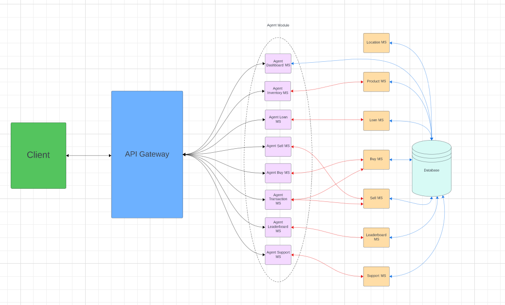
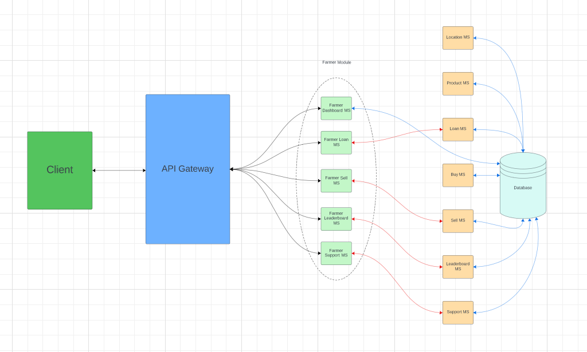
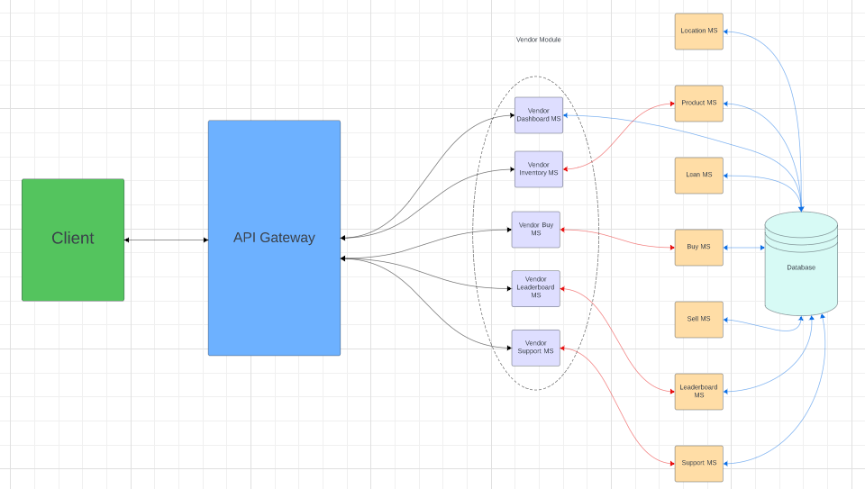
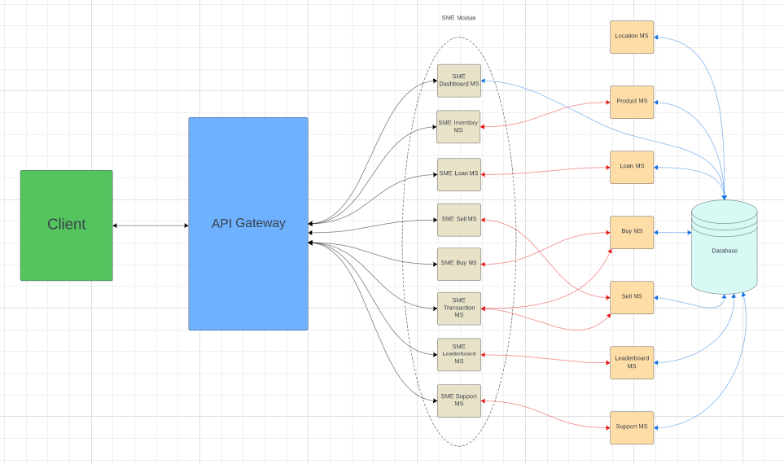

# Pushti

## Overview

This application is a marketplace platform designed to connect dairy and Poultryfarmers directly with Vendors and SMEs (Small & Medium Entrepreneurs). It facilitates the trade of raw and processed products while also offering loans to Farmers and SMEs that will be repaid as more and more goods are sold thorugh the app.

## Key Features

- Farmers can sell dairy and poultry product to the platform.
- SMEs can purchase products, process it (e.g., make sweets), and sell it back to the platform.
- Vendors can purchase raw and processed products from the platform.
- Farmers and SMEs can take loans, repaid incrementally as they sell products.
- Agents handle operational management, ensuring smooth processes across the marketplace.
- Admins oversee the entire system and review comprehensive reports generated by the platform.

## Architecture

The application is built using a microservice architecture to ensure scalability and modularity. Key components:

- **Frontend**: Svelte, for a reactive and lightweight user interface.
- **Backend**: Express.js, for handling APIs and server-side logic.
- **Database**: PostgreSQL, for robust data management.

## Individual Repositories

- **Frontend**: [Pushti-Frontend](https://github.com/Shattik/PushtiFrontEnd)
- **REST-API**:
  - [API Documentation](https://github.com/tahmid-404-20/PushtiApiDoc)
  - [API Gateway](https://github.com/Shattik/PushtiApiGateway)
  - [Service Registry](https://github.com/tahmid-404-20/Pushti-ServiceRegistry)
- **Top Level User Services**:
  - [Agent Service](https://github.com/Shattik/Pushti-Agent-Service)
  - [Farmer Service](https://github.com/tahmid-404-20/Pushti-FarmerService)
  - [Vendor Service](https://github.com/tahmid-404-20/Pushti-VendorService)
  - [SME Service](https://github.com/Shattik/Pushti-SmeService)
  - [Admin Service](https://github.com/tahmid-404-20/Pushti-AdminService)
- **Bottom Level Services**:
  - [Authentication Service](https://github.com/tahmid-404-20/Pushti-Authentication)
  - [Product Service](https://github.com/Shattik/PushtiProduct)
  - [Buy Service](https://github.com/Shattik/PushtiBuy)
  - [Sell Service](https://github.com/Shattik/PushtiSell)
  - [Loan Service](https://github.com/Shattik/PushtiLoan)
  - [Leaderboard Service](https://github.com/Shattik/PushtiLeaderboard)
  - [Location Service](https://github.com/tahmid-404-20/PushtiLocation)
  - [Support Service](https://github.com/tahmid-404-20/Pushti-SupportTicket)

## High-Level System Diagram

### User Type:Agent

### User Type:Farmer

### User Type:Vendor

### User Type:SME

## Acknowledgments

Special thanks to our supervisor, open-source libraries, and frameworks that made this project possible.
